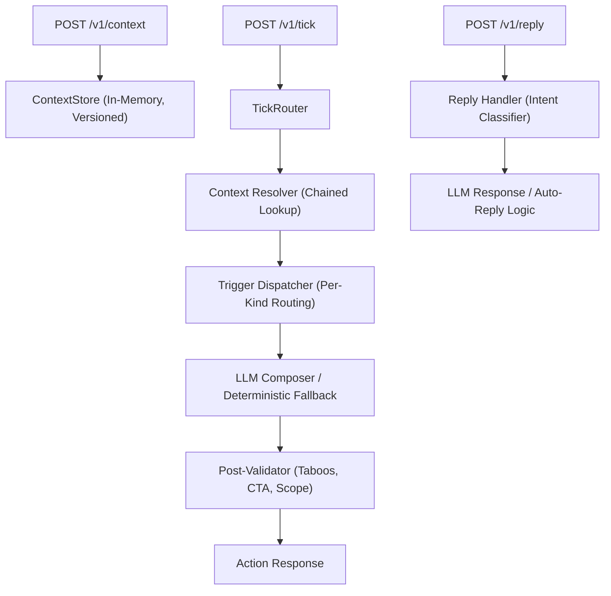

# Vera: magicpin Merchant Engagement AI

Vera is a robust, LLM-powered merchant assistant bot designed for the magicpin AI Challenge. It operates on a **4-Context Framework** to deliver deterministic, high-specificity engagement across multiple business verticals (Dentists, Salons, Gyms, Pharmacies, Restaurants).

## 🚀 Key Features

- **4-Context Composition Engine**: Every message is composed using `Category`, `Merchant`, `Trigger`, and optional `Customer` context layers.
- **Deterministic Prompt Routing**: Routes over 20+ trigger types to specialized prompt variants.
- **Data-Driven Fallback**: Operates gracefully even without an LLM key using high-quality deterministic templates.
- **Stateful Conversation Management**: Handles incremental context pushes, auto-reply detection, and intent-driven transitions.
- **Multi-Provider Support**: Seamlessly switch between OpenAI, Anthropic, Gemini, and DeepSeek.

## 🏗️ Architecture



## 🛠️ Getting Started

### Prerequisites

- Python 3.10+
- `pip`

### Installation

1. Clone the repository:
   ```bash
   git clone https://github.com/yourusername/magicpin-agent.git
   cd magicpin-agent
   ```

2. Install dependencies:
   ```bash
   pip install -r requirements.txt
   ```

### Running the Bot

Start the FastAPI server:
```bash
# Default port 8080
python bot.py
```

### Configuration

Set environment variables to enable LLM-powered compositions:
```bash
export LLM_PROVIDER=openai # or anthropic, gemini, deepseek
export LLM_API_KEY=your_api_key
export LLM_MODEL=gpt-4o-mini # optional
```

## 🧪 Testing

The bot is fully compatible with the `judge_simulator.py` harness provided in the challenge.

1. Start the bot (see above).
2. Run the simulator:
   ```bash
   python judge_simulator.py
   ```

## 📂 Project Structure

- `bot.py`: Main FastAPI entry point and LLM client.
- `composer/`: Core logic package.
  - `context_store.py`: Thread-safe, versioned in-memory storage.
  - `resolver.py`: Resolves triggers to full 4-context tuples.
  - `dispatcher.py`: Routes triggers and handles fallback logic.
  - `prompts.py`: Prompt templates and composition guidance.
  - `validator.py`: Post-composition constraint enforcement.
  - `reply_handler.py`: Multi-turn conversation and intent logic.

## 📝 License

This project is part of the magicpin AI Challenge.
